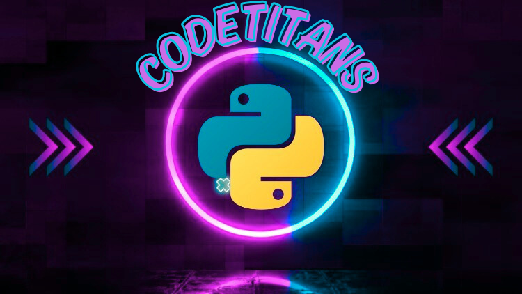

# CodeTitans

## Descripción

Repositorio para el **_Tercer_** semestre del grupo **"CodeTitans"** estudiantes de la Tec. en Programación **UTN**.

## Integrantes

- [**Leandro Gonzalez**](https://github.com/leanlag87)
- [**Ignacio Villarraza**](https://github.com/NashVille912)
- [**Guillermo Pacheco**](https://github.com/gpacheco001)
- [**Denis Taraboreli**](https://github.com/denist050)
- [**Martiniano Zallocco**](https://github.com/sarox23)

## Como nos vamos a organizar este semestre

Para este semestre, vamos a utilizar la metodología **Scrum** para organizar nuestro trabajo. Nos reuniremos semanalmente para revisar nuestro progreso y ajustar nuestras tareas según sea necesario. Utilizaremos herramientas como **GitHub Projects** para gestionar nuestras tareas y **Discord** para comunicarnos de manera efectiva.

## Proyecto

[**Nuestro proyecto Python**](https://github.com/PowerSystem2024/CodeTitans-IntegradorPython)

[Nuestro Portafolio en Vue](https://codetitans-utn.netlify.app/)

## Tecnologías

- **Java**
- **JavaScript**
- **Python**
- **MySQL**
- **PostgreSQL**
- **Vue**

## Herramientas

- **Git**
- **GitHub**
- **Netlify**
- **Vue CLI**
- **Insomnia**
- **Discord**

## Enlaces

- [Nuestro proyecto Java](https://github.com/PowerSystem2024/CodeTitansIntegradorJava/tree/main/ProyectoIntegradorJava)
- [Nuestro proyecto Python](https://github.com/PowerSystem2024/CodeTitans-IntegradorPython)
- [Nuestro Portafolio en Vue](https://codetitans-utn.netlify.app/)
